# Mynd

**_Give every AI a photographic memory of YOUR life - securely, locally, forever_**

> **The Problem:** Every AI conversation starts from zero. ChatGPT doesn't remember what you discussed yesterday. Copilot doesn't know your coding style. Claude forgets your preferences. It's like having digital Alzheimer's.

> **The Solution:** Mynd gives EVERY AI perfect memory of your context - securely, privately, forever.

## What is Mynd?

Mynd is a **universal memory layer** for AI that automatically captures your digital context and streams it securely to any AI via Model Context Protocol (MCP). Your AIs finally remember everything about you - your decisions, preferences, history, and patterns - while your data never leaves your device.

## System Architecture

### High-Level Architecture

```mermaid
graph TB
    subgraph "Data Sources"
        Browser["🌐 Browser History"]
        Files["📄 Documents & Code"]
        Clipboard["📋 Clipboard"]
        Git["🔧 Git Repositories"]
    end
    
    subgraph "Mynd Core"
        Capture["📥 Data Capture"]
        Extract["🧠 Semantic Extractor"]
        Privacy["🔒 Privacy Filter"]
        
        subgraph "Storage"
            SQLite["📊 SQLite DB<br/>(Metadata)"]
            ChromaDB["🧠 ChromaDB<br/>(Vectors)"]
        end
        
        MCP["🔗 MCP Server"]
    end
    
    subgraph "AI Clients"
        ChatGPT["💬 ChatGPT"]
        Claude["🤖 Claude"]
        Copilot["👨‍💻 GitHub Copilot"]
        AnyAI["🤖 Any AI Tool"]
    end
    
    Browser --> Capture
    Files --> Capture
    Clipboard --> Capture
    Git --> Capture
    
    Capture --> Extract
    Extract --> Privacy
    Privacy --> SQLite
    Privacy --> ChromaDB
    
    SQLite --> MCP
    ChromaDB --> MCP
    
    MCP -->|"Secure Context"| ChatGPT
    MCP -->|"Secure Context"| Claude
    MCP -->|"Secure Context"| Copilot
    MCP -->|"Secure Context"| AnyAI
    
    style Extract fill:#ff6b6b,stroke:#fff,stroke-width:3px
    style Privacy fill:#4ecdc4,stroke:#333,stroke-width:2px
    style MCP fill:#f39c12,stroke:#333,stroke-width:2px
```


### Data Flow Process


## The Memory Crisis (The $2.3T Problem)

**Every AI interaction wastes massive time on context setup:**

- **73% of AI conversations** repeat information from previous chats
- **2.3 hours daily** lost re-explaining context to AI
- **$2.3 trillion annually** in global productivity loss
- **89% of professionals** frustrated with AI's goldfish memory

**Real Examples:**
- "What was that API decision we made last month?" → *"I don't have context"*
- "Continue our React project" → *"Can you share the codebase?"*
- "Remember my coding style preferences" → *"Please describe them again"*

## Mynd Demo Script (2 Minutes)

```bash
# The Setup (30 seconds)
"Every AI suffers from digital amnesia. Watch this..."

[User asks ChatGPT]: "What was that authentication architecture decision from last month?"
[ChatGPT]: "I don't have access to previous conversations..."

# The Magic (60 seconds)
[Install Mynd]: mynd demo
[Capture context]: "Mynd has been learning your patterns..."

[Same question to ChatGPT + Mynd]:
mynd query "authentication architecture decision"

[Result]: "You decided on JWT with refresh tokens over sessions on March 15th 
because of mobile app requirements. You were concerned about XSS attacks but 
chose client-side storage anyway because your team lacks Redis expertise."

# The Jaw-Drop (30 seconds)
"This context came from:
✅ Your browser research from 6 weeks ago
✅ Code comments you wrote in March  
✅ A design doc you saved locally
✅ All delivered securely via MCP - your data never left your machine"
```

## Quick Start (2 Minutes to Life-Changing AI)

### Component Initialization Flow


```bash
# Install Mynd
./install.sh  # or pip install -e .

# Set up demo data
mynd demo

# Test the magic
mynd query "authentication architecture"

# Watch AI get perfect memory of your decisions!
```

## AgentHacks 2025 Categories

### **PRIMARY: Personalization & Memory** 
- ✅ **Learns from user activity**: Continuous semantic capture
- ✅ **Evolves behavior over time**: Memory graph grows and improves
- ✅ **User corrections improve system**: Feedback loop for better context
- ✅ **Personal preference adaptation**: Learns your patterns and style

### **SECONDARY: Interfaces for Human-AI Collaboration**
- ✅ **Revolutionizes AI interaction**: No more context re-explanation
- ✅ **Seamless collaboration**: AI knows your full background
- ✅ **Natural communication**: AI understands your references and history

## Business Model & Market

### Market Size
- **TAM**: $450B (Global productivity software market)
- **SAM**: $67B (AI tools and services) 
- **SOM**: $12B (AI productivity and memory solutions)

### Revenue Model

```mermaid
graph TD
    Personal["🆓 Mynd Personal<br/>FREE Forever<br/>• 30-day memory<br/>• 3 data sources<br/>• Community support"] 
    
    Pro["💎 Mynd Pro<br/>$29/month<br/>• Unlimited memory<br/>• All data sources<br/>• Priority MCP access<br/>• Advanced privacy controls"]
    
    Enterprise["🏢 Mynd Enterprise<br/>$199/user/month<br/>• Team memory sharing<br/>• Compliance controls<br/>• Custom integrations<br/>• White-label deployment"]
    
    Personal --> Pro
    Pro --> Enterprise
    
    style Personal fill:#4ecdc4
    style Pro fill:#f39c12
    style Enterprise fill:#e74c3c
```


## Security & Privacy Architecture

### Privacy-First Data Flow

```mermaid
graph TB
    subgraph "Your Device (Secure Zone)"
        Raw["📝 Raw Data<br/>(Browser, Files, Code)"]
        PII["🔒 PII Detection<br/>(Remove Sensitive Info)"]
        LLM["🧠 Local LLM<br/>(Semantic Extraction)"]
        Encrypt["🔐 Encrypted Storage<br/>(SQLite + ChromaDB)"]
    end
    
    subgraph "External AI (Untrusted)"
        ChatGPT["💬 ChatGPT"]
        Claude["🤖 Claude"] 
        Other["🤖 Other AIs"]
    end
    
    Raw --> PII
    PII --> LLM
    LLM --> Encrypt
    
    Encrypt -->|"Semantic Context Only<br/>(No Raw Data)"| ChatGPT
    Encrypt -->|"Semantic Context Only<br/>(No Raw Data)"| Claude
    Encrypt -->|"Semantic Context Only<br/>(No Raw Data)"| Other
    
    style Raw fill:#ff6b6b,stroke:#333,stroke-width:2px
    style PII fill:#4ecdc4,stroke:#333,stroke-width:2px
    style LLM fill:#f39c12,stroke:#333,stroke-width:2px
    style Encrypt fill:#27ae60,stroke:#333,stroke-width:2px
```


**Privacy Promise**: Your raw data NEVER leaves your device. Only semantic meaning is processed, stored locally, and delivered via encrypted MCP.

## Success Metrics & Validation

### Technical Milestones ✅
- [x] Core semantic extraction engine (Local LLM + privacy filters)
- [x] Local encrypted storage (ChromaDB + SQLite)
- [x] MCP server architecture with capability tokens
- [x] Browser history and document capture framework
- [x] CLI interface with full functionality

### Demo Readiness ✅ 
- [x] 2-minute live demo script prepared
- [x] Real context database with semantic events
- [x] Multiple query examples working
- [x] Clear before/after comparison ready

## Join the Memory Revolution

Mynd isn't just a hackathon project - it's the future of AI interaction. We're building the memory layer that every AI desperately needs.

**For Developers**: Finally, coding AI that knows your entire project history
**For Knowledge Workers**: AI assistants that remember every decision and context  
**For Everyone**: The end of explaining the same thing to AI over and over

---