# Mynd - System Architecture

**Complete technical architecture and design documentation**

## 🎯 Architecture Overview

Mynd is built as a **modular, privacy-first memory system** that captures semantic context from user activities and delivers it securely to AI clients via Model Context Protocol (MCP).

### High-Level System Design

```mermaid
graph TB
    subgraph "Data Sources"
        Browser["🌐 Browser Activity<br/>• History<br/>• Research patterns<br/>• Decision making"]
        Files["📄 Documents & Code<br/>• Project files<br/>• Notes & decisions<br/>• Git repositories"]
        System["🖥️ System Activity<br/>• Clipboard<br/>• Application usage<br/>• Workflow patterns"]
    end
    
    subgraph "Mynd Core Engine"
        Capture["📥 Data Capture Layer<br/>• File watchers<br/>• Browser monitoring<br/>• Content extraction"]
        
        subgraph "Processing Pipeline"
            Extract["🧠 Semantic Extractor<br/>• Local LLM (Ollama)<br/>• Concept extraction<br/>• Decision context"]
            Privacy["🔒 Privacy Filter<br/>• PII detection<br/>• Data sanitization<br/>• Content validation"]
        end
        
        subgraph "Storage Subsystem"
            SQLite[(📊 SQLite Database<br/>• Event metadata<br/>• Relationships<br/>• Statistics)]
            ChromaDB[(🧠 Vector Store<br/>• Semantic embeddings<br/>• Similarity search<br/>• Context retrieval)]
        end
        
        subgraph "Security Layer"
            Tokens["🎫 Capability Tokens<br/>• Time-limited access<br/>• Scope restrictions<br/>• Audit trail"]
            Encryption["🔐 Data Encryption<br/>• Local encryption<br/>• Secure transport<br/>• Key management"]
        end
    end
    
    subgraph "AI Integration Layer"
        MCP["🔗 MCP Server<br/>• Context delivery<br/>• Protocol compliance<br/>• Request handling"]
        
        subgraph "AI Clients"
            ChatGPT["💬 ChatGPT<br/>• Conversation context<br/>• Decision history<br/>• Preference memory"]
            Claude["🤖 Claude<br/>• Task context<br/>• Learning patterns<br/>• Usage history"]
            Copilot["👨‍💻 GitHub Copilot<br/>• Code context<br/>• Architecture decisions<br/>• Development patterns"]
            Custom["🔧 Custom AI Tools<br/>• API integration<br/>• Specialized context<br/>• Domain knowledge"]
        end
    end
    
    Browser --> Capture
    Files --> Capture
    System --> Capture
    
    Capture --> Extract
    Extract --> Privacy
    Privacy --> SQLite
    Privacy --> ChromaDB
    
    SQLite --> Tokens
    ChromaDB --> Tokens
    Tokens --> Encryption
    Encryption --> MCP
    
    MCP --> ChatGPT
    MCP --> Claude
    MCP --> Copilot
    MCP --> Custom
    
    style Extract fill:#ff6b6b,stroke:#fff,stroke-width:3px
    style Privacy fill:#4ecdc4,stroke:#333,stroke-width:2px
    style MCP fill:#f39c12,stroke:#333,stroke-width:2px
```

## 🏗️ Component Architecture

### Layered Architecture Design

```mermaid
graph TB
    subgraph "Presentation Layer"
        CLI["💻 Command Line Interface<br/>src/cli.py"]
        WebUI["🌐 Web UI (Future)<br/>FastAPI + React"]
        Extensions["🔌 Browser Extensions<br/>Context injection"]
    end
    
    subgraph "Application Layer"
        Orchestrator["🎯 Main Orchestrator<br/>src/main.py<br/>• Component coordination<br/>• Workflow management<br/>• Error handling"]
        
        subgraph "Core Services"
            Extractor["🧠 Semantic Extractor<br/>src/semantic_extractor.py<br/>• LLM processing<br/>• Concept extraction<br/>• Privacy filtering"]
            
            Capturer["📥 Data Capture<br/>src/capture.py (Future)<br/>• Browser monitoring<br/>• File watching<br/>• Content analysis"]
            
            QueryEngine["🔍 Query Engine<br/>src/vector_storage.py<br/>• Semantic search<br/>• Context ranking<br/>• Result optimization"]
        end
    end
    
    subgraph "Data Layer"
        Database["📊 Database Manager<br/>src/database.py<br/>• CRUD operations<br/>• Schema management<br/>• Statistics"]
        
        VectorStore["🧠 Vector Storage<br/>src/vector_storage.py<br/>• Embedding storage<br/>• Similarity search<br/>• Index management"]
        
        Models["🗂️ Data Models<br/>src/models.py<br/>• Type definitions<br/>• Validation<br/>• Serialization"]
    end
    
    subgraph "Infrastructure Layer"
        FileSystem["📁 File System<br/>• Local storage<br/>• Data encryption<br/>• Backup management"]
        
        LLM["🤖 Local LLM<br/>• Ollama integration<br/>• Model management<br/>• Inference pipeline"]
        
        Security["🔒 Security Services<br/>• PII detection<br/>• Encryption<br/>• Access control"]
    end
    
    CLI --> Orchestrator
    WebUI --> Orchestrator
    Extensions --> Orchestrator
    
    Orchestrator --> Extractor
    Orchestrator --> Capturer
    Orchestrator --> QueryEngine
    
    Extractor --> Database
    Extractor --> VectorStore
    QueryEngine --> VectorStore
    Capturer --> Database
    
    Database --> Models
    VectorStore --> Models
    
    Database --> FileSystem
    VectorStore --> FileSystem
    Extractor --> LLM
    Extractor --> Security
    
    style Orchestrator fill:#f39c12,stroke:#333,stroke-width:3px
    style Extractor fill:#ff6b6b,stroke:#333,stroke-width:2px
    style Security fill:#4ecdc4,stroke:#333,stroke-width:2px
```

## 📊 Data Architecture

### Data Model Relationships

### Storage Architecture

## 🔄 Processing Pipelines

### Semantic Extraction Pipeline

### Query Processing Pipeline

```mermaid
sequenceDiagram
    participant U as 👤 User/AI Client
    participant Q as 🔍 Query Engine
    participant V as 🧠 Vector Store
    participant D as 📊 Database
    participant O as 🎯 Optimizer
    participant S as 🔒 Security
    
    U->>Q: Query request with context
    Q->>S: Validate capability token
    S->>Q: Token validation result
    
    Q->>V: Semantic similarity search
    V->>V: Generate query embedding
    V->>V: Find similar vectors
    V->>Q: Ranked results with scores
    
    Q->>D: Fetch event metadata
    D->>Q: Complete event details
    
    Q->>O: Optimize for token limits
    O->>O: Rank by relevance
    O->>O: Compress content
    O->>O: Format response
    O->>Q: Optimized context
    
    Q->>S: Log access event
    S->>D: Store audit record
    
    Q->>U: Formatted context response
    
    Note over V: ChromaDB performs<br/>cosine similarity search
    Note over O: Smart compression to<br/>fit AI context windows
    Note over S: Complete audit trail<br/>for security compliance
```

## 🔒 Security Architecture

### Multi-Layer Security Model

```mermaid
graph TB
    subgraph "Physical Security"
        Device["💻 Local Device<br/>• Hardware encryption<br/>• Secure boot<br/>• TPM integration"]
    end
    
    subgraph "Application Security"
        Process["🔒 Process Isolation<br/>• Sandboxed execution<br/>• Limited permissions<br/>• Resource constraints"]
        
        Crypto["🔐 Cryptographic Protection<br/>• AES-256 encryption<br/>• Key derivation<br/>• Secure random generation"]
        
        PII_Filter["🛡️ PII Protection<br/>• Pattern recognition<br/>• Content filtering<br/>• Safe data extraction"]
    end
    
    subgraph "Network Security"
        TLS["🌐 Transport Security<br/>• TLS 1.3<br/>• Certificate validation<br/>• Perfect forward secrecy"]
        
        MCP_Auth["🎫 MCP Authentication<br/>• Capability tokens<br/>• Time-limited access<br/>• Scope restrictions"]
    end
    
    subgraph "Data Security"
        Local["🏠 Local Processing<br/>• No cloud dependency<br/>• On-device inference<br/>• Offline capability"]
        
        Audit["📋 Audit Logging<br/>• Access tracking<br/>• Change monitoring<br/>• Compliance reporting"]
    end
    
    Device --> Process
    Process --> Crypto
    Crypto --> PII_Filter
    
    PII_Filter --> TLS
    TLS --> MCP_Auth
    
    MCP_Auth --> Local
    Local --> Audit
    
    style PII_Filter fill:#ff6b6b,stroke:#333,stroke-width:2px
    style Local fill:#27ae60,stroke:#333,stroke-width:2px
    style MCP_Auth fill:#f39c12,stroke:#333,stroke-width:2px
```

### Privacy Protection Flow

## 🌐 MCP Integration Architecture

### Model Context Protocol Implementation

```mermaid
graph TB
    subgraph "AI Client Applications"
        ChatGPT_Web["💬 ChatGPT Web<br/>Browser Extension"]
        Claude_API["🤖 Claude API<br/>Direct Integration"]
        VSCode["👨‍💻 VS Code Extension<br/>Copilot Enhancement"]
        Custom["🔧 Custom Applications<br/>MCP SDK Integration"]
    end
    
    subgraph "MCP Server Layer"
        Router["🚦 Request Router<br/>• Endpoint routing<br/>• Load balancing<br/>• Error handling"]
        
        Auth["🔐 Authentication<br/>• Client verification<br/>• Token validation<br/>• Rate limiting"]
        
        Context["📋 Context Manager<br/>• Query processing<br/>• Result formatting<br/>• Token optimization"]
        
        Capability["🎫 Capability System<br/>• Permission grants<br/>• Scope management<br/>• Expiration handling"]
    end
    
    subgraph "Mynd Core"
        Query["🔍 Query Engine"]
        Storage["💾 Storage Layer"]
        Security["🔒 Security Layer"]
    end
    
    ChatGPT_Web --> Router
    Claude_API --> Router
    VSCode --> Router
    Custom --> Router
    
    Router --> Auth
    Auth --> Context
    Context --> Capability
    
    Context --> Query
    Capability --> Security
    Query --> Storage
    
    style Router fill:#3498db,stroke:#333,stroke-width:2px
    style Auth fill:#ff6b6b,stroke:#333,stroke-width:2px
    style Context fill:#f39c12,stroke:#333,stroke-width:2px
```

### MCP Protocol Flow

```mermaid
sequenceDiagram
    participant AI as 🤖 AI Client
    participant MCP as 🔗 MCP Server
    participant Cap as 🎫 Capability Manager
    participant Ctx as 📋 Context Engine
    participant Store as 💾 Storage
    
    AI->>MCP: Initialize connection
    MCP->>Cap: Request capability token
    Cap->>Cap: Generate time-limited token
    Cap->>MCP: Return capability token
    MCP->>AI: Connection established
    
    AI->>MCP: Context request with query
    MCP->>Cap: Validate capability token
    Cap->>MCP: Token validation result
    
    MCP->>Ctx: Process context query
    Ctx->>Store: Semantic search
    Store->>Ctx: Relevant memories
    Ctx->>Ctx: Optimize for AI context window
    Ctx->>MCP: Formatted context
    
    MCP->>AI: Context response
    
    Note over Cap: Tokens expire after 5 minutes<br/>for security
    Note over Ctx: Smart compression ensures<br/>context fits AI limits
```

## 🔧 Development Architecture

### Modular Component Design

```mermaid
graph TB
    subgraph "Core Modules"
        Models["🗂️ models.py<br/>• Data structures<br/>• Type definitions<br/>• Validation logic"]
        
        Database["📊 database.py<br/>• SQLite operations<br/>• Schema management<br/>• Query optimization"]
        
        Vector["🧠 vector_storage.py<br/>• ChromaDB integration<br/>• Embedding management<br/>• Similarity search"]
        
        Extractor["🔍 semantic_extractor.py<br/>• LLM processing<br/>• Privacy filtering<br/>• Content analysis"]
    end
    
    subgraph "Application Modules"
        Main["🎯 main.py<br/>• Application orchestration<br/>• Component coordination<br/>• Lifecycle management"]
        
        CLI["💻 cli.py<br/>• Command interface<br/>• User interaction<br/>• System control"]
    end
    
    subgraph "Configuration"
        PyProject["📋 pyproject.toml<br/>• Dependencies<br/>• Build configuration<br/>• Tool settings"]
        
        Requirements["📦 requirements.txt<br/>• Package versions<br/>• Dependency tree<br/>• Environment specs"]
    end
    
    Models --> Database
    Models --> Vector
    Models --> Extractor
    
    Database --> Main
    Vector --> Main
    Extractor --> Main
    
    Main --> CLI
    
    PyProject --> Requirements
    Requirements --> Models
    
    style Models fill:#4ecdc4,stroke:#333,stroke-width:2px
    style Main fill:#f39c12,stroke:#333,stroke-width:2px
    style CLI fill:#e74c3c,stroke:#333,stroke-width:2px
```

### Extension Architecture

```mermaid
graph LR
    subgraph "Browser Extensions"
        Chrome["🔧 Chrome Extension<br/>• Context injection<br/>• History capture<br/>• Real-time analysis"]
        
        Firefox["🦊 Firefox Extension<br/>• Privacy focused<br/>• Enhanced security<br/>• Local processing"]
    end
    
    subgraph "IDE Integrations"
        VSCode_Ext["👨‍💻 VS Code Extension<br/>• Code context<br/>• Git integration<br/>• Architecture memory"]
        
        JetBrains["🧠 JetBrains Plugin<br/>• Smart suggestions<br/>• Pattern recognition<br/>• Code intelligence"]
    end
    
    subgraph "Desktop Applications"
        Electron["⚡ Electron App<br/>• System tray<br/>• Global shortcuts<br/>• Cross-platform"]
        
        Native["🖥️ Native Apps<br/>• Platform specific<br/>• Deep integration<br/>• Performance optimized"]
    end
    
    subgraph "Mynd Core API"
        MCP_API["🔗 MCP Server<br/>• Standard protocol<br/>• Secure access<br/>• Context delivery"]
    end
    
    Chrome --> MCP_API
    Firefox --> MCP_API
    VSCode_Ext --> MCP_API
    JetBrains --> MCP_API
    Electron --> MCP_API
    Native --> MCP_API
    
    style MCP_API fill:#f39c12,stroke:#333,stroke-width:3px
```

## 📈 Performance Architecture

### Scalability Design

```mermaid
graph TB
    subgraph "Data Volume Management"
        Partition["📊 Data Partitioning<br/>• Time-based sharding<br/>• Source type separation<br/>• Intelligent archiving"]
        
        Compression["🗜️ Content Compression<br/>• Semantic deduplication<br/>• Vector quantization<br/>• Token optimization"]
        
        Indexing["📇 Smart Indexing<br/>• Multi-dimensional indices<br/>• Query optimization<br/>• Cache management"]
    end
    
    subgraph "Query Performance"
        Cache["🚄 Query Caching<br/>• LRU cache<br/>• Prefetch strategies<br/>• Hit ratio optimization"]
        
        Async["⚡ Async Processing<br/>• Non-blocking I/O<br/>• Concurrent queries<br/>• Pipeline optimization"]
        
        Batch["📦 Batch Operations<br/>• Bulk insertions<br/>• Vectorization<br/>• Transaction optimization"]
    end
    
    subgraph "Resource Management"
        Memory["🧠 Memory Management<br/>• Streaming processing<br/>• Memory pooling<br/>• Garbage collection"]
        
        CPU["⚡ CPU Optimization<br/>• Multi-threading<br/>• SIMD operations<br/>• Load balancing"]
        
        Storage["💾 Storage Optimization<br/>• SSD optimization<br/>• WAL mode<br/>• Connection pooling"]
    end
    
    Partition --> Cache
    Compression --> Async
    Indexing --> Batch
    
    Cache --> Memory
    Async --> CPU
    Batch --> Storage
    
    style Cache fill:#27ae60,stroke:#333,stroke-width:2px
    style Async fill:#3498db,stroke:#333,stroke-width:2px
    style Memory fill:#f39c12,stroke:#333,stroke-width:2px
```

---

This architecture provides a **robust, scalable, and secure foundation** for universal AI memory, designed to handle real-world usage patterns while maintaining strict privacy guarantees. 