# Mynd - Component Architecture

**Detailed visual guide to how each component works and interacts**

## 🏗️ Component Overview

### Core Components Structure
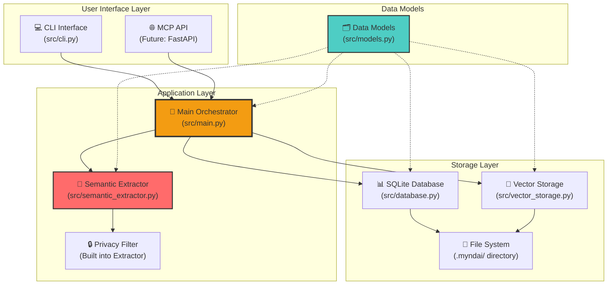

## 🔄 Component Interactions

### 1. CLI Command Flow
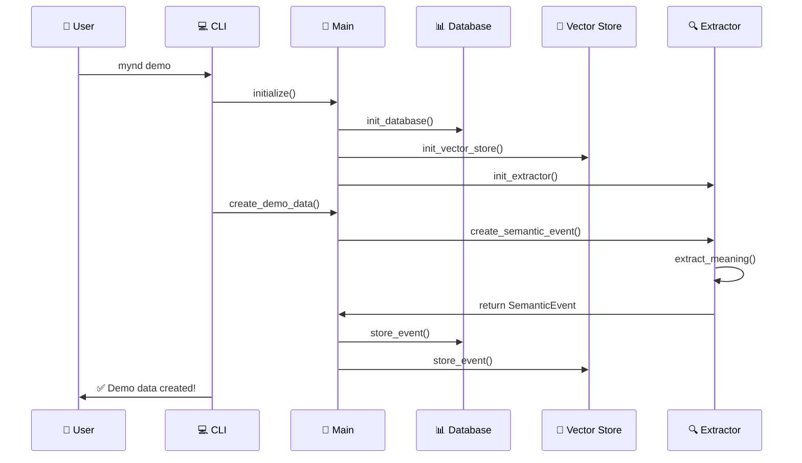

### 2. Query Processing Flow
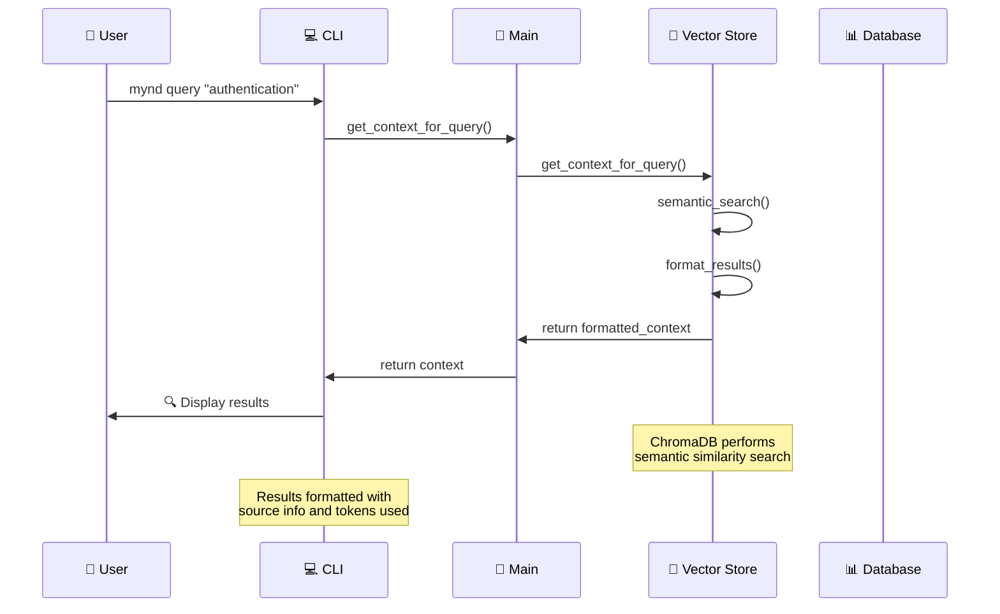

### 3. Data Storage Architecture
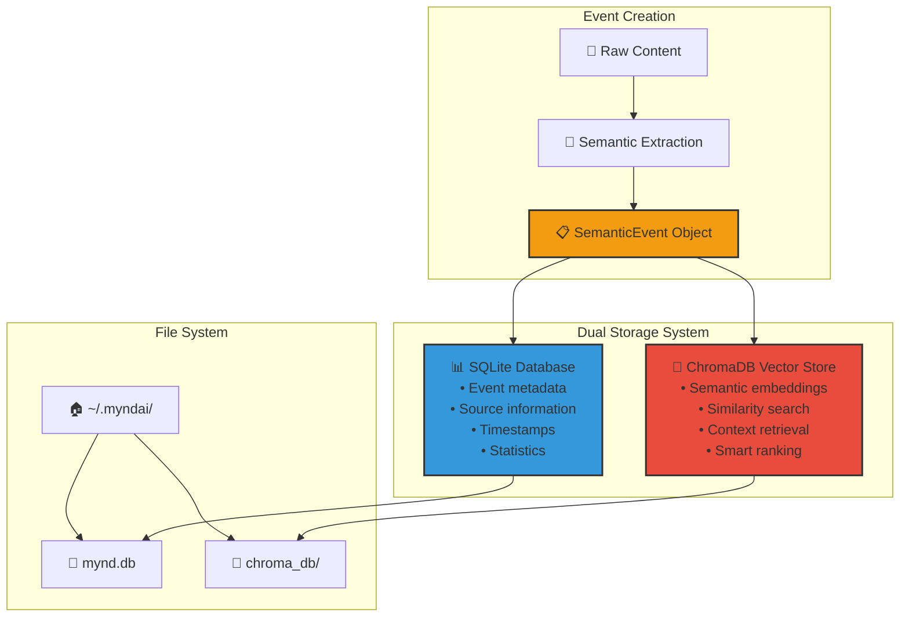

## 🧠 Semantic Extractor Deep Dive

### Semantic Processing Pipeline
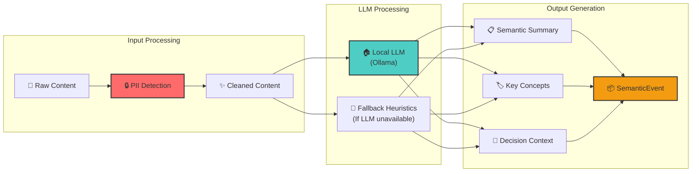

### Privacy Protection Flow
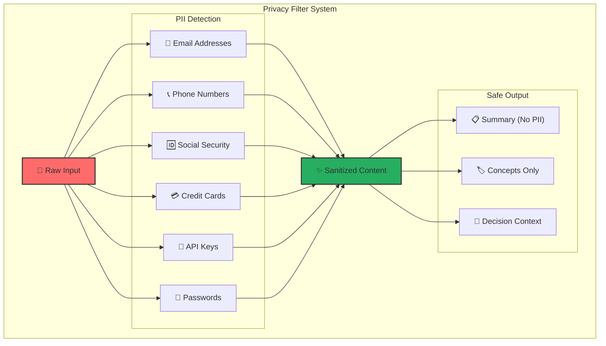

## 📊 Database Schema & Relationships

### SQLite Database Structure
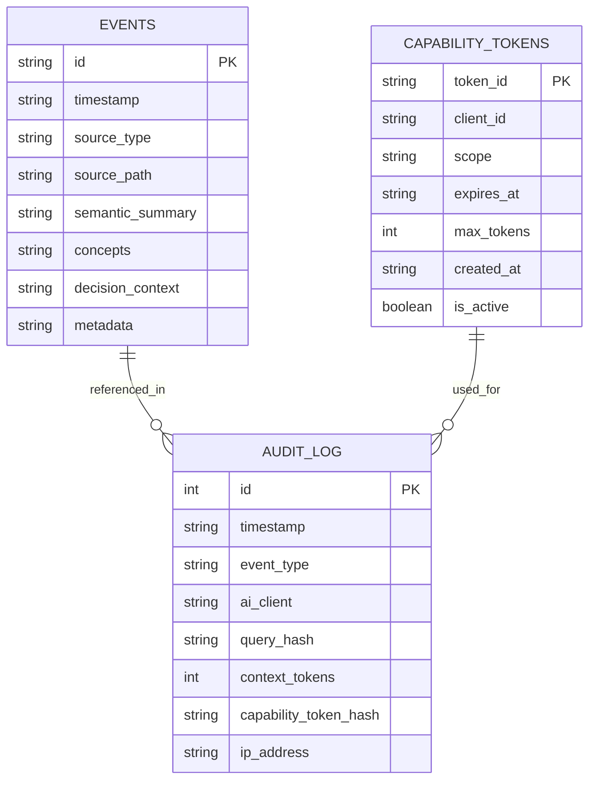

### Vector Storage Structure
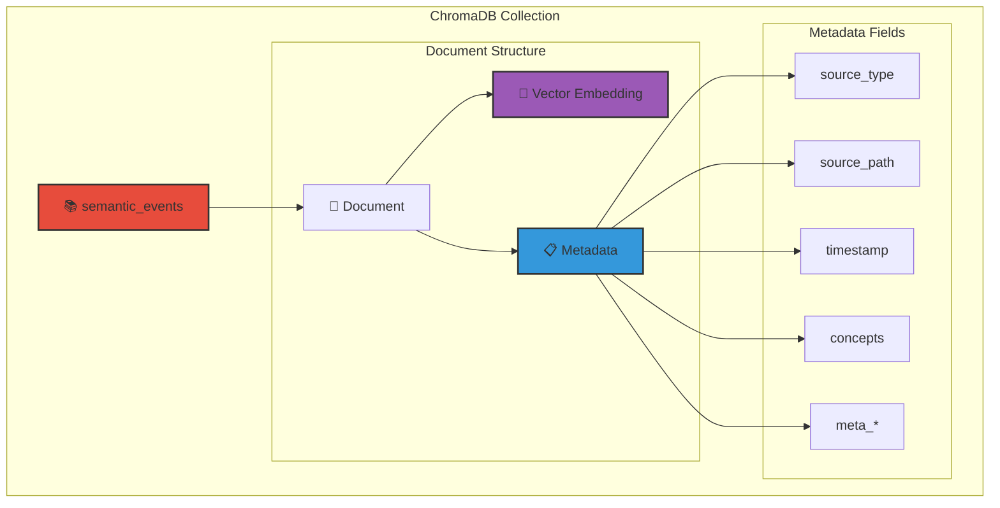

## 🔍 Query Processing Deep Dive

### Semantic Search Process
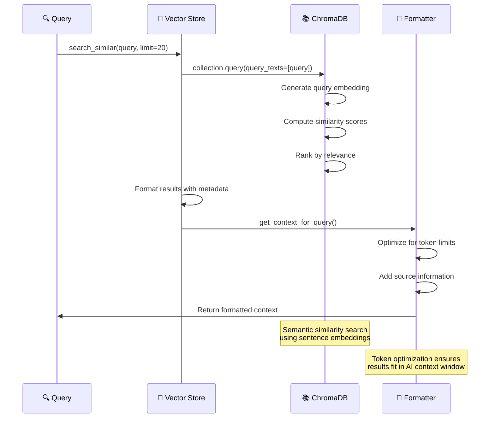

### Context Optimization Process
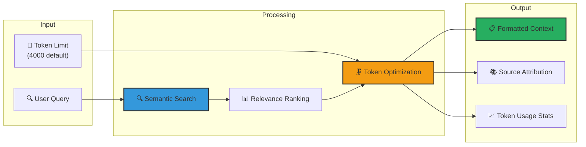

## 🔧 CLI Interface Structure

### Command Architecture
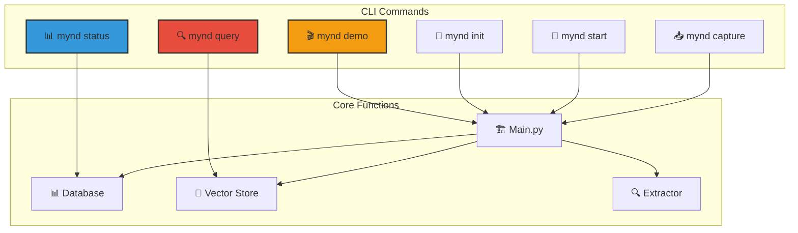

## 🚀 Future MCP Server Architecture

### Planned MCP Integration
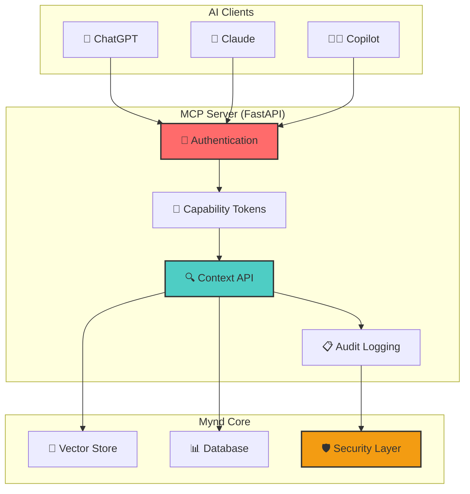

## 🔒 Security Architecture

### Data Protection Layers
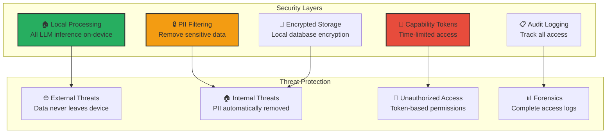

---

## 📚 Component File Reference

| Component | File | Purpose |
|-----------|------|---------|
| **Data Models** | `src/models.py` | Core data structures and types |
| **Database** | `src/database.py` | SQLite operations and schema |
| **Vector Store** | `src/vector_storage.py` | ChromaDB semantic search |
| **Semantic Extractor** | `src/semantic_extractor.py` | LLM processing and privacy |
| **Main Orchestrator** | `src/main.py` | Application coordination |
| **CLI Interface** | `src/cli.py` | Command-line interface |

Each component is designed to be **modular**, **testable**, and **independently maintainable** while working together seamlessly to provide the universal AI memory experience. 