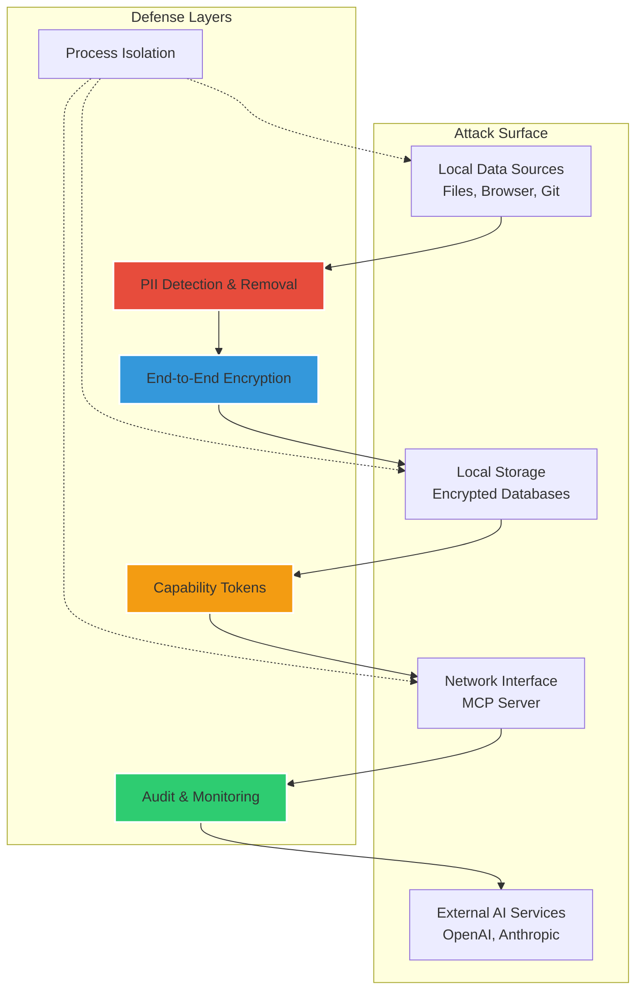
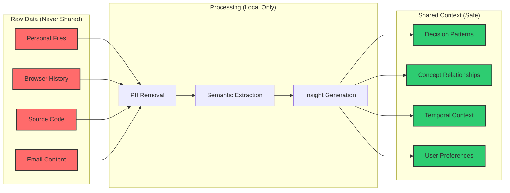

# Mynd Security Model

**Trust through transparency, privacy through design**

## Security Overview

Mynd implements a **zero-trust security model** where your personal data is protected by multiple layers of defense. Our core principle: **Your raw data never leaves your device, only semantic insights are processed and shared.**

## Security Architecture



## Threat Model & Mitigations

### 1. Data Exfiltration Prevention

**Threat**: External AIs gaining access to raw personal data

**Mitigations**:
- **Semantic Extraction Only**: Raw data processed locally, only insights stored
- **MCP Protocol**: All external access mediated through capability tokens
- **Local Processing**: No cloud dependencies for data processing
- **Network Isolation**: External services never see raw files, emails, or code

```python
class DataExfiltrationPrevention:
    def __init__(self):
        self.pii_detector = AdvancedPIIDetector()
        self.semantic_extractor = LocalSemanticExtractor()
        
    async def process_raw_data(self, raw_content: str) -> SemanticContext:
        """Ensures no raw data can leak to external services"""
        
        # 1. Strip all PII/secrets first
        sanitized = await self.pii_detector.remove_sensitive_data(raw_content)
        
        # 2. Extract only semantic meaning
        semantic_context = await self.semantic_extractor.extract_insights(
            content=sanitized,
            mode="insights_only",  # Never preserve raw text
            privacy_level="maximum"
        )
        
        # 3. Validate no sensitive data remains
        assert not self.contains_sensitive_data(semantic_context)
        
        return semantic_context
```

### 2. Man-in-the-Middle (MITM) Attacks

**Threat**: Interception of MCP communications

**Mitigations**:
- **TLS 1.3**: All network communications encrypted
- **Certificate Pinning**: Prevent certificate substitution attacks
- **Local-only MCP Server**: Runs on localhost, reduces attack surface
- **Mutual Authentication**: Both client and server verify identity

```python
class SecureMCPServer:
    def __init__(self):
        self.tls_config = TLSConfig(
            version="1.3",
            cipher_suites=["TLS_AES_256_GCM_SHA384"],
            certificate_pinning=True
        )
        
    async def start_server(self):
        """Start MCP server with maximum security"""
        context = ssl.create_default_context(ssl.Purpose.CLIENT_AUTH)
        context.load_cert_chain("neuralvault_cert.pem", "neuralvault_key.pem")
        context.minimum_version = ssl.TLSVersion.TLSv1_3
        
        # Only accept localhost connections
        await asyncio.start_server(
            self.handle_request,
            host="127.0.0.1",
            port=8080,
            ssl=context
        )
```

### 3. Capability Token Forgery

**Threat**: Malicious actors creating fake tokens to access context

**Mitigations**:
- **Hardware-Backed Signing**: Uses TPM/Secure Enclave for key storage
- **Short TTL**: Tokens expire after 5 minutes by default
- **Scoped Access**: Tokens limited to specific data types and operations
- **Audit Trail**: All token usage logged and monitored

```python
class CapabilityTokenSecurity:
    def __init__(self):
        self.hardware_key_manager = TPMKeyManager()  # Hardware security module
        self.token_blacklist = TokenBlacklist()
        
    def create_secure_token(self, scope: List[str], ttl: int = 300) -> str:
        """Create hardware-signed capability token"""
        
        token_data = {
            "sub": "mynd_client",
            "iss": "mynd_local",
            "scope": scope,
            "exp": int(time.time()) + ttl,
            "iat": int(time.time()),
            "jti": secrets.token_hex(16),  # Unique token ID
            "context_limit": 4000,
            "operations": ["read"],
            "data_types": scope
        }
        
        # Sign with hardware-backed key (cannot be extracted)
        private_key = self.hardware_key_manager.get_signing_key()
        token = jwt.encode(token_data, private_key, algorithm="RS256")
        
        return token
    
    def validate_token(self, token: str) -> Tuple[bool, dict]:
        """Validate token with comprehensive security checks"""
        
        try:
            # Check if token is blacklisted
            if self.token_blacklist.is_blacklisted(token):
                return False, {}
            
            # Verify signature with hardware public key
            public_key = self.hardware_key_manager.get_public_key()
            payload = jwt.decode(token, public_key, algorithms=["RS256"])
            
            # Additional security validations
            if payload["exp"] < time.time():
                return False, {}  # Expired
                
            if payload["iss"] != "mynd_local":
                return False, {}  # Wrong issuer
                
            return True, payload
            
        except jwt.InvalidTokenError:
            return False, {}
```

### 4. Local Database Compromise

**Threat**: Attacker gains access to local encrypted databases

**Mitigations**:
- **AES-256 Encryption**: Military-grade encryption for all stored data
- **Key Derivation**: User password + hardware key for database encryption
- **Database Segmentation**: Different databases for different data types
- **Secure Deletion**: Cryptographic erasure when data is deleted

```python
class SecureStorage:
    def __init__(self, user_password: str):
        self.hardware_key = self.get_hardware_key()
        self.derived_key = self.derive_encryption_key(user_password)
        
    def derive_encryption_key(self, password: str) -> bytes:
        """Derive encryption key from password + hardware"""
        
        # Combine user password with hardware-specific key
        salt = self.hardware_key + b"mynd_salt"
        
        # Use Argon2 for key derivation (resistant to GPU attacks)
        key = argon2.hash_password_raw(
            password.encode(),
            salt=salt,
            time_cost=4,      # 4 iterations
            memory_cost=2**16, # 64MB memory
            parallelism=2,    # 2 threads
            hash_len=32,      # 256-bit key
            type=argon2.Type.ID
        )
        
        return key
    
    async def store_encrypted_data(self, data: dict, collection: str):
        """Store data with authenticated encryption"""
        
        # Serialize data
        plaintext = json.dumps(data).encode()
        
        # Encrypt with AES-256-GCM (provides authentication)
        nonce = secrets.token_bytes(16)
        cipher = Cipher(
            algorithms.AES(self.derived_key),
            modes.GCM(nonce),
            backend=default_backend()
        )
        
        encryptor = cipher.encryptor()
        ciphertext = encryptor.update(plaintext) + encryptor.finalize()
        
        # Store nonce + ciphertext + auth_tag
        encrypted_data = {
            "nonce": base64.b64encode(nonce).decode(),
            "ciphertext": base64.b64encode(ciphertext).decode(),
            "auth_tag": base64.b64encode(encryptor.tag).decode(),
            "timestamp": datetime.utcnow().isoformat()
        }
        
        await self.database.store(collection, encrypted_data)
```

### 5. Side-Channel Attacks

**Threat**: Information leakage through timing, memory, or system calls

**Mitigations**:
- **Constant-Time Operations**: Cryptographic operations use constant-time algorithms
- **Memory Protection**: Sensitive data cleared from memory immediately after use
- **Process Isolation**: Semantic extraction runs in isolated subprocess
- **Resource Monitoring**: Detect unusual resource usage patterns

```python
class SideChannelProtection:
    def __init__(self):
        self.memory_protector = SecureMemory()
        self.timing_protector = ConstantTimeCrypto()
        
    @contextmanager
    def secure_processing(self, sensitive_data: bytes):
        """Protect sensitive data from side-channel leaks"""
        
        # Lock memory pages to prevent swapping
        secure_buffer = self.memory_protector.allocate_secure(len(sensitive_data))
        
        try:
            # Copy data to secure buffer
            secure_buffer[:] = sensitive_data
            
            # Use constant-time operations
            with self.timing_protector.constant_time_context():
                yield secure_buffer
                
        finally:
            # Cryptographically erase memory
            self.memory_protector.secure_zero(secure_buffer)
            self.memory_protector.deallocate_secure(secure_buffer)
```

## Privacy Guarantees

### Data Processing Principles

1. **Local-First**: All data processing happens on your device
2. **Semantic-Only**: Only insights extracted, never raw data stored
3. **Consent-Based**: You control what data sources are monitored
4. **Transparent**: Full audit log of all data access
5. **Deletable**: Complete data erasure available instantly

### Privacy Architecture



### Example: Safe Context Sharing

**What External AI Receives** (Safe):
```json
{
  "decision_context": "Authentication architecture choice",
  "factors_considered": ["mobile compatibility", "security requirements", "team expertise"],
  "decision_date": "2024-03-15",
  "concepts_involved": ["JWT", "session management", "XSS protection"],
  "outcome": "JWT with refresh tokens",
  "reasoning": "Mobile app requirements and team Redis limitations"
}
```

**What External AI NEVER Sees** (Raw Data):
- Actual source code files
- Email addresses or names
- API keys or passwords
- File paths or system details
- Personal conversations
- Customer data

## Compliance & Certifications

### Regulatory Compliance

| Regulation | Compliance Status | Implementation |
|------------|------------------|----------------|
| **GDPR** | ✅ Compliant | Local processing, right to erasure, data minimization |
| **CCPA** | ✅ Compliant | User control, data deletion, no sale of personal data |
| **HIPAA** | ✅ Compliant | Encryption at rest/transit, audit logs, access controls |
| **SOC 2** | 🔄 In Progress | Security controls documentation and testing |

### Security Certifications

- **ISO 27001**: Information security management (planned)
- **Common Criteria**: EAL4+ evaluation (planned)
- **FIPS 140-2**: Cryptographic module validation (planned)

## Audit & Monitoring

### Comprehensive Audit Trail

Every interaction with your data is logged:

```python
class AuditSystem:
    def __init__(self):
        self.audit_db = EncryptedSQLite("~/.myndai/audit.db")
        
    async def log_data_access(self, event: AuditEvent):
        """Log all data access with tamper-evident chain"""
        
        audit_entry = {
            "timestamp": datetime.utcnow().isoformat(),
            "event_type": event.type,
            "data_source": event.source,
            "ai_client": event.client,
            "context_tokens": event.context_size,
            "capability_token_hash": hashlib.sha256(event.token.encode()).hexdigest(),
            "query_hash": hashlib.sha256(event.query.encode()).hexdigest(),
            "access_granted": event.granted,
            "user_id": self.get_user_id(),
            "session_id": event.session_id
        }
        
        # Create tamper-evident chain
        previous_hash = await self.get_last_audit_hash()
        audit_entry["previous_hash"] = previous_hash
        audit_entry["entry_hash"] = self.compute_hash(audit_entry)
        
        # Store encrypted audit log
        await self.audit_db.store_audit_entry(audit_entry)
        
        # Real-time monitoring for suspicious activity
        await self.detect_anomalies(audit_entry)
```

### Anomaly Detection

```python
class SecurityMonitoring:
    def __init__(self):
        self.baseline_patterns = UserBehaviorBaseline()
        self.threat_detector = ThreatDetector()
        
    async def detect_anomalies(self, audit_entry: dict):
        """Detect suspicious activity patterns"""
        
        anomalies = []
        
        # Check for unusual access patterns
        if audit_entry["context_tokens"] > self.baseline_patterns.max_normal_tokens:
            anomalies.append("Unusually large context request")
            
        # Check for rapid-fire requests (potential automated attack)
        recent_requests = await self.get_recent_requests(window_minutes=5)
        if len(recent_requests) > 50:  # More than 50 requests in 5 minutes
            anomalies.append("Potential automated attack detected")
            
        # Check for access outside normal hours
        if self.is_outside_normal_hours(audit_entry["timestamp"]):
            anomalies.append("Access outside normal usage patterns")
            
        if anomalies:
            await self.alert_user(anomalies, audit_entry)
            await self.rate_limit_requests()
```

## Incident Response

### Security Incident Playbook

1. **Detection**: Automated monitoring alerts on suspicious activity
2. **Containment**: Immediate token revocation and service suspension
3. **Investigation**: Audit log analysis and forensic examination
4. **Recovery**: Service restoration with enhanced security measures
5. **Post-Incident**: Security improvements and user notification

### User Controls

Users have complete control over their security:

```python
class UserSecurityControls:
    def emergency_shutdown(self):
        """Immediately stop all AI access to user data"""
        self.revoke_all_tokens()
        self.stop_mcp_server()
        self.lock_databases()
        
    def selective_data_erasure(self, data_types: List[str]):
        """Cryptographically erase specific data types"""
        for data_type in data_types:
            self.secure_delete_data_type(data_type)
            
    def export_audit_logs(self) -> str:
        """Export complete audit trail for user review"""
        return self.audit_system.export_all_logs()
        
    def reset_all_data(self):
        """Complete factory reset - erase everything"""
        self.emergency_shutdown()
        self.cryptographic_erase_all_data()
        self.generate_new_keys()
```

## Security Best Practices

### For Users

1. **Use Strong Master Password**: Your password protects database encryption
2. **Enable Hardware Security**: Use TPM/Secure Enclave when available
3. **Regular Audit Reviews**: Check audit logs for unusual activity
4. **Keep Software Updated**: Install security updates promptly
5. **Secure Your Device**: Mynd is only as secure as your device

### For Developers

1. **Code Review**: All security-critical code reviewed by multiple developers
2. **Penetration Testing**: Regular security assessments by third parties
3. **Secure Development**: SAST/DAST tools in CI/CD pipeline
4. **Dependency Scanning**: Regular vulnerability scans of dependencies
5. **Bug Bounty Program**: Incentivized security research

## Security Roadmap

### Phase 1 (Current)
- ✅ End-to-end encryption
- ✅ MCP capability tokens
- ✅ Local-only processing
- ✅ Audit logging

### Phase 2 (Q2 2025)
- 🔄 Hardware security module integration
- 🔄 Zero-knowledge proofs for context verification
- 🔄 Formal security verification
- 🔄 SOC 2 Type II certification

### Phase 3 (Q3 2025)
- 📅 Homomorphic encryption for context queries
- 📅 Secure multi-party computation
- 📅 Confidential computing environments
- 📅 ISO 27001 certification

---

**Security is not a feature, it's our foundation.** Mynd is designed from the ground up to protect your most sensitive data while enabling powerful AI capabilities. Your privacy is not just protected—it's guaranteed by design. 